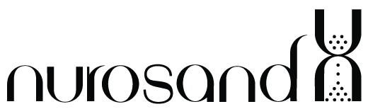

<div align="center">



### Closed-loop neurorehab that fits your day

Adaptive daily exercises, hands-free voice coaching, and weekly clinician sign-off, all connected in one feedback loop.

</div>

---

## Status

**What this hackathon build focuses on:** the end-to-end **closed-loop web product** in `web/` — clinician care plans, the daily adapter, voice-guided patient sessions, Nuroport review, and weekly doctor sign-off.

**What we also built as working pipelines (not yet wired into that web app):**

| Pipeline | Status |
|----------|--------|
| **Apple Watch** HR / IMU → local Mac receiver → live browser graph | Proven end-to-end on device; **not plugged into** the patient session, wellness, or doctor dashboard yet |
| **Meta Ray-Ban** camera sample via Wearables DAT | Sample runs; **not plugged into** the patient environment-scan / coaching flow yet |

In the web demo, wearable connection and environment scan are simulated / UI-complete so the product story is clear. The Watch and Ray-Ban repos below are the real hardware pipelines ready to connect next.

**AI vs hardcoded (demo honesty):** the product direction is for **AI** to power form analysis, Nuroport reporting, live coaching cues, and environment-scan understanding. In this build those pieces are **hardcoded / scripted** so the full closed-loop UX can be demoed end-to-end without live models. The UI, data flow, and clinician sign-off path are real; the “intelligence” layer is stubbed for the hackathon.

## What it does

Nurosand turns neuro-rehab into a **closed feedback loop** between the patient at home and their clinician:

1. **Doctor** sets a care plan (focus areas, frequency, notes) for each patient.
2. **Daily adapter** builds today's session from the plan + recent performance + sleep + the last signed doctor note.
3. **Patient** runs a hands-free, voice-guided session with live form feedback and exercise demos.
4. **Weekly report** summarizes adherence, per-focus progress and sleep for the doctor to review and **sign off**.
5. That sign-off feeds straight back into the adapter, closing the loop.

```
session performance + sleep ─▶ daily adapter ─▶ voice-guided session
        ▲                                              │
        │                                              ▼
   doctor sign-off ◀── weekly report ◀── logged results
```

## Highlights (web product)

- **Clinician dashboard** — caseload overview, per-patient weekly improvement charts, alerts, and one-tap report sign-off.
- **Patient app** — today's session, wearable data panel, environment scan flow, and a post-session **Nuroport** with video form clips and per-clip feedback.
- **Hands-free coaching** — say "go" to start; the coach walks you through every rep with live-style cues (scripted for demo; intended to be AI-driven from form/video).
- **Voice** — high-quality ElevenLabs TTS when configured, with a graceful browser/Samantha fallback.
- **Nuroport & space scan** — post-session report and environment scan flows are in product; analysis content is hardcoded today, AI next.
## Tech stack

| Layer | Stack |
|-------|-------|
| Frontend | Next.js (App Router), TypeScript, Tailwind CSS |
| Backend | FastAPI, SQLModel, SQLite |
| Voice | ElevenLabs TTS (browser fallback) |
| Watch pipeline *(separate)* | watchOS (HealthKit) + TCP stream + local Python receiver |
| Glasses pipeline *(separate)* | Meta Wearables Device Access Toolkit (iOS sample) |

## Repository layout

| Path | Role |
|------|------|
| `web/` | **Main deliverable:** Next.js frontend + FastAPI backend |
| `web/app/` | Doctor and patient pages (App Router) |
| `web/backend/app/` | API, daily adapter, weekly reports, seed data |
| `Nurosand Watch App/` | Watch pipeline: HR / motion streaming app |
| `server/` | Watch pipeline: local TCP + HTTP/SSE receiver + live graph |
| `ios-rayban/` | Glasses pipeline notes (SDK cloned separately) |

## Quick start (web app)

**Backend** (Python 3.11 / 3.12):

```bash
cd web/backend
python3 -m venv .venv
source .venv/bin/activate
pip install -r requirements.txt
uvicorn app.main:app --reload --port 8000
```

**Frontend:**

```bash
cd web
npm install
npm run dev
```

Open http://localhost:3000. On first run the backend seeds a demo doctor, patients and exercise library into `web/backend/nurosand.db` (delete that file to reset).

### Demo logins

These are demo-only credentials (not real auth).

| Role | How to sign in |
|------|----------------|
| **Clinician** | Go to `/doctor` → password: `doc` |
| **Patient** | Go to `/patient` → **full name** + password = **last name** (lowercase) |

Examples:

| Full name | Password |
|-----------|----------|
| Quentin Tarantino | `tarantino` |
| Lucy Williams | `williams` |
| Alex Morgan | `morgan` |
| Sam Rivera | `rivera` |

Try it: open **/doctor** to set a plan and sign a report, or **/patient** to run a voice-guided session and view the Nuroport.

See [`web/README.md`](web/README.md) for backend deploy notes, ElevenLabs setup, and the full flow.

## Hardware pipelines (not integrated into the web app yet)

### Apple Watch heart-rate / IMU stream

We validated streaming live Apple Watch heart rate (and motion) to a browser graph over the local network. That path is **standalone** today: Watch → Mac receiver → live Chart.js page. It does not yet feed the FastAPI backend or patient UI.

```bash
python3 server/receiver.py          # listens on TCP 8765, serves the graph
ipconfig getifaddr en0              # find your Mac's LAN IP
```

Open `Nurosand.xcodeproj` in Xcode, run the **Nurosand Watch App** scheme on a physical Watch, enter your Mac's IP, and tap **Start**. Watch and Mac must share Wi-Fi; real optical HR needs a physical Watch.

Watch sends newline-delimited JSON over TCP: `{"bpm":72,"t":1710000000.0}`

**Next step:** POST samples into the web backend wellness / session APIs so HR and motion can drive adaptation and the clinician charts for real.

### Meta Ray-Ban glasses

We explored Meta's Wearables Device Access Toolkit camera sample for hands-free environment scanning. The sample runs on a real iPhone + glasses; it is **not yet** connected to the patient "scan my space" flow in the web app (that flow is demoed in-product with upload / webcam / voice).

The vendored SDK is cloned separately (git-ignored here). See [`ios-rayban/README.md`](ios-rayban/README.md).

**Next step:** forward glasses frames into the same Mac hub / web backend used for sessions, so a real space scan can tag props for the daily adapter.

---

<div align="center">
Built for a hackathon. Closed-loop UX is the main demo; Watch / Ray-Ban are proven pipelines; analysis, Nuroport, and scan intelligence are hardcoded stand-ins for the AI layer.
</div>
